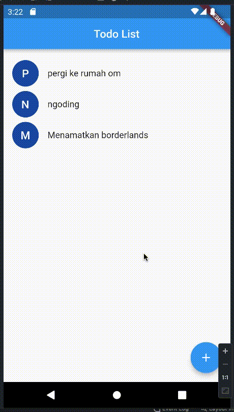

# task_list

A simple task list.

## Feature

1. Add task
2. Mark task as done and otherwise
3. Delete task

## Technology

1. SQLite using [sqflite](https://pub.dev/packages/sqflite) as storage
2. BLoC using [flutter_bloc](https://pub.dev/packages/flutter_bloc) as controller 
3. [Equatable](https://pub.dev/packages/equatable) using to simplify comparing objects
4. [AnimatedList](https://api.flutter.dev/flutter/widgets/AnimatedList-class.html) with in-built animation when inserting and deleting items

## Showcase

